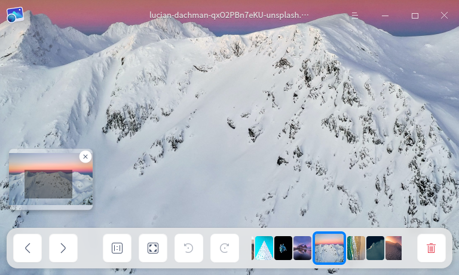
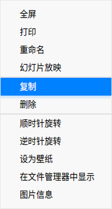

# 看图|../common/deepin-image-viewer.svg|

## 概述

看图是一款小巧的图片查看应用软件。外观时尚、性能流畅，支持多种图片格式，随时想看就看，实用又快捷。

## 使用入门

通过以下方式运行或关闭看图，或者创建看图的快捷方式。

### 运行看图

1. 点击桌面底部的  ，进入启动器界面。
2. 上下滚动鼠标滚轮浏览或通过搜索，找到看图 点击运行。
3. 右键单击 ，您可以：
 - 点击 **发送到桌面**，在桌面创建快捷方式。
 - 点击 **发送到任务栏**，将应用程序固定到任务栏。
 - 点击 **开机自动启动**，将应用程序添加到开机启动项，在电脑开机时自动运行该应用。

### 关闭看图

- 在看图界面点击  ，退出看图。
- 在任务栏右键单击 ，选择 **关闭所有** 来退出看图。
- 在看图界面点击 ，选择 **退出** 来退出看图。

### 查看快捷键

在看图界面上，按下键盘上的按下键盘上的 **Ctrl + Shift + ?** 组合键来查看快捷键。

## 图片查看

### 打开图片
采用以下任一方式打开图片。
- 右击图片，选择用看图工具打开图片。
- 设置看图为默认的图片查看程序后，可双击图片打开。
- 运行看图后，点击 **打开图片**，选择文件打开。
- 运行看图后，拖动图片到看图界面，打开图片。
- 直接拖动图片到看图在桌面或任务栏的图标，打开图片。

> 窍门：您可以在控制中心中将看图设置为默认的图片查看程序，具体操作请参阅 [默认程序设置](dman:///dde#默认程序设置)。

图片支持的格式BMP、ICO、JPG/JPE/JPEG、PNG、TGA、TIF/TIFF、XPM、GIF、SGI、RAW、WEBP、CR2、NEF、DNG、RAF、MEF、MRW、XBM、SVG、ORF、MNG。

> 说明：如果您的电脑支持触控屏或触控板，可以使用手势替代鼠标来放大缩小查看图片：
   > - 在触控屏上：二指张开，放大图片；二指捏合，缩小图片。
   > - 在触控板上（触控板支持多点触控）：二指张开，放大图片；二指捏合，缩小图片。

### 界面介绍

| 图标                                               | 名称       | 说明                   |
| -------------------------------------------------- | ---------- | ---------------------- |
|                      | 上一张     | 显示上一张图片。       |
|                              | 下一张     | 显示下一张图片。       |
|                | 1:1视图    | 图片按照实际尺寸显示。 |
|              | 适应窗口   | 图片适应窗口尺寸显示。 |
|  | 顺时针旋转 | 图片顺时针旋转90度。   |
|              | 逆时针旋转 | 图片逆时针旋转90度。   |
|                          | 删除       | 删除当前图片。         |

&nbsp;&nbsp;&nbsp;&nbsp;&nbsp;&nbsp;&nbsp;&nbsp;&nbsp;&nbsp;&nbsp;&nbsp;&nbsp;
> 窍门：滚动鼠标放大图片且当图片超出界面范围时，界面上会出现导航窗口。拖动导航窗口内的方框，查看该区域的信息。点击导航窗口右上角 **x** 按钮，关闭导航窗口；也可以在看图界面上单击鼠标右键选择 **隐藏导航窗口**/**显示导航窗口**。

### 打印图片

1. 在看图界面上，单击鼠标右键。
2. 选择 **打印**。
3. 选择一个打印机。
4. 根据需要设置打印属性。
5. 选择 **打印**，将图片发送到打印机进行打印。

### 重命名

1. 在看图界面上，单击鼠标右键。
2. 选择 **重命名**，在弹出的重命名窗口内，将图片名字进行修改。
3. 点击 **确定** 完成修改。
>说明：系统图片不支持重命名。

### 幻灯片放映

1. 在看图界面上，单击鼠标右键。
2. 选择 **幻灯片放映**，图片将以幻灯片形式全屏播放。
4. 按下键盘上**Esc** 键退出播放。

### 复制图片

1. 在看图界面上，单击鼠标右键。
2. 选择 **复制**。
3. 在桌面或者指定位置，单击鼠标右键。
4. 选择 **粘贴**，将图片文件复制到该位置。

> 窍门：点击 **复制** 会同时复制图片路径和内容。

### 删除图片

在看图中您可以通过如下方法删除图片：

- 点击看图界面上的   图标。
- 右键单击图片，选择 **删除**。
- 在看图界面上，按下键盘的 **Delete** 键。

### 旋转图片

1. 在看图界面上，单击鼠标右键。
2. 选择 **顺时针旋转/逆时针旋转**。
3. 图片将会顺时针转旋转90°/逆时针旋转90°。
   
   > 说明：如果您的电脑支持触控屏或触控板，可以使用手势代替鼠标操作：
      > - 在触控屏上：二指放置在图片上并保持一定距离，同时旋转二指来旋转图片。
      > - 在触控板上（触控板支持多点触控）：二指放置在图片上并保持一定距离，同时旋转二指来旋转图片。

### 设置为壁纸

1. 在看图界面上，单击鼠标右键。
2. 选择 **设为壁纸** 即可将当前图片设置为壁纸。

### 在文件管理器中显示
1. 在看图界面上，单击鼠标右键。
2. 选择 **在文件管理器中显示**，打开并定位该图片所在的文件夹位置。

### 查看图片信息

1. 在看图界面上，单击鼠标右键。
2. 选择 **图片信息** 可以显示图片信息。

## 主菜单

在主菜单中，您可以切换窗口主题、查看帮助手册，了解看图的更多信息。

### 主题

窗口主题包含浅色主题、深色主题和跟随系统主题。

1. 在看图界面，点击  。
2. 点击 **主题**，选择一个主题颜色。

### 帮助

查看帮助手册，进一步了解和使用看图。

1. 在看图界面，点击  。
2. 点击 **帮助**。
3. 查看看图的帮助手册。

### 关于

1. 在看图界面，点击  。
2. 点击 **关于**。
3. 查看看图的版本和介绍。

### 退出

1. 在看图界面，点击 。
2. 点击 **退出**。   

文档更新时间: 2020-11-24 版本: 5.6
