# Deepin Image Viewer|../common/deepin-image-viewer.svg|

## Overview|../common/icon_overview.svg|

Deepin Image Viewer is an image viewer and management application elaborately designed by Deepin Technology, Inc. It is fashion and elegant in interface, fast and efficient for your daily management of images. The management functions of Deepin Image Viewer can let you sort the images by timeline and categorized the images by different albums to keep them in good order.

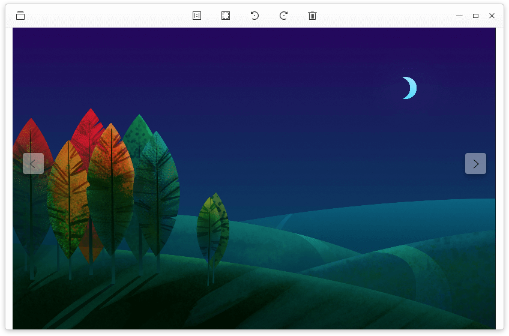

## Guide|../common/icon_guide.svg|

User can run, close and create shortcut for Deepin Image Viewer by the following ways.

### Run Deepin Image Viewer

1. Click on  or move the mouse pointer to the upper left corner of the screen to enter Launcher interface.
2. Locate  by scrolling mouse wheel or searching by "deepin image viewer" in Launcher interface.
3. Right click on , user can
 - Click on **Send to desktop** to create a desktop shortcut.
 - Click on **Send to dock** to fix the application on dock.
 - Click on **Add to startup** to add the application to startup, it will automatically run when the system starts up.

> : In Control Center, user can set Deepin Image Viewer as the default image viewer. Specific operations refer to [Default Application Settings](dman:///dde-control-center#Default Application Settings).

### Close Deepin Image Viewer

1. In Deepin Image Viewer interface, click on  to exit Deepin Image Viewer.
2. Right click on  on dock, select **Close all** to exit Deepin Image Viewer.
3. Click on  and select **Exit** to exit Deepin Image Viewer.

## View Image|../common/icon_pictureview.svg|

Deepin Image Viewer is featured with image information viewing, image rotation, slide show, image viewing in timeline and album, and so on. Right click on an image, select ** Open with** > ** Deepin Image Viewer**. If Deepin Image Viewer has been set as the default application for image viewing, user can double-click to open an image with it.

### Image Viewing Interface

<table class="block1">
    <caption></caption>
    <tbody>
        <tr>
            <td></td>
            <td>Image management</td>
            <td>Enter image management interface of Deepin Image Viewer .</td>
        </tr>
        <tr>
            <td></td>
            <td>1:1 Size</td>
            <td>The image will show in 1:1 size without changing the size of the window. If the image exceeds the window, a navigation window will appear at the lower right corner, which helps user to fast locate image areas.</td>
        </tr>
		<tr>
            <td></td>
            <td>Fit to window</td>
            <td>The image will resize to adapt to the current window.</td>
        </tr>
	    <tr>
            <td></td>
            <td>Rotate clockwise</td>
            <td>Rotate the image 90 degrees clockwise.</td>
        </tr>
	    <tr>
            <td></td>
            <td>Rotate counterclockwise</td>
            <td>Rotate the image 90 degrees counterclockwise.</td>
        </tr>
	    <tr>
            <td></td>
            <td>Throw to Trash</td>
            <td>Throw the current image to Trash.</td>
        </tr>
        <tr>
            <td></td>
            <td>Previous</td>
            <td>Switch to the previous image.</td>
        </tr>
        <tr>
            <td></td>
            <td>Next</td>
            <td>Switch to the next image.</td>
        </tr>
    </tbody>
</table>

> : In 1:1 size mode, user can click on  at the upper left corner of navigation window to close it, then it won't automatically show next time. User can select to disable/enable the navigation window in the context menu.

> : By clicking,  and  will switch to each other.

### Start Slide Show

User can start a slide show of all the images in the folder.

1. Open an image in a folder with Deepin Image Viewer.
2. Right click on the image in Deepin Image Viewer interface and select ** Start slide show**.
3. Deepin Image Viewer will enter fullscreen mode and start slide show.
4. To exit slide show, right click on the slide show and select ** Stop slide show**, or press  key.

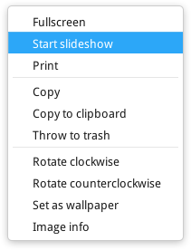

### Copy Image

User can copy images in Deepin Image Viewer.

1. Right click on the image in Deepin Image Viewer interface and select ** Copy **.
2. On the target place, right click on the blank area and select ** Paste ** to copy image to the place.

> ：**Copy to Clipboard** is an enhancement of the copy function, whereas this option can be used to copy the image as the content of the document, or the image should be send to friends.

### Print Image

User can print image in Deepin Image Viewer.

1. Right click on the image in Deepin Image Viewer interface and select ** Print **.
2. Choose a printer and set the print options.
3. Click on ** Print ** to send the picture to the printer.

> ：If you selected a PDF printer, you'll need to choose where to place the printed pdf file.

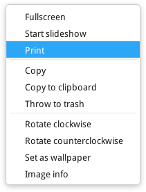

### Delete Image

User can delete images from Deepin Image Viewer by the following ways.

- Click on the  icon on the Deepin Image Viewer interface. 
- Right click on the image to delete and select ** Throw to Trash**.
- Click on the image to delete and press  key.

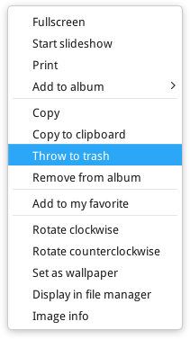

>: The deleted image will also be deleted from disk.

### Rotate Image

User can rotate the image in image viewing interface.
1. Right click on the image in Deepin Image Viewer interface and select ** Rotate clockwise** or ** Rotate counterclockwise**.
2. The image will rotate clockwise or counterclockwise for 90 degrees.

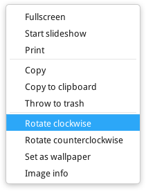

### Set Image as Wallpaper

User can set an image as the desktop wallpaper. Right click on the image in Deepin Image Viewer interface and select **Set as wallpaper**.

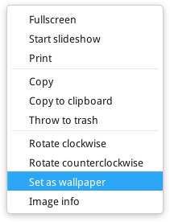

### View Image Information

User can view the detailed information of the image.
1. Right click on the image in Deepin Image Viewer interface and select ** Image info**
2. An information window will pop up at the left side of Deepin Image Viewer interface.

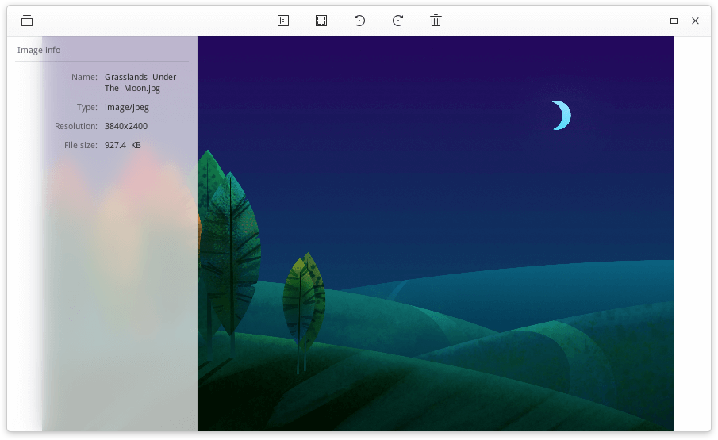

## Image Management|../common/icon_picturemanagement.svg|

In image management interface, user can make changes to timeline and albums, and use search and filter to find the target image. By clicking on  and  to switch between Timeline and Album.

### Timeline

Click on  in Deepin Image Viewer interface to enter Timeline interface.
The images in Timeline are ranked and grouped according to the date photoed/created. The same date, the same group. From the top to the bottom are the latest to the earliest.

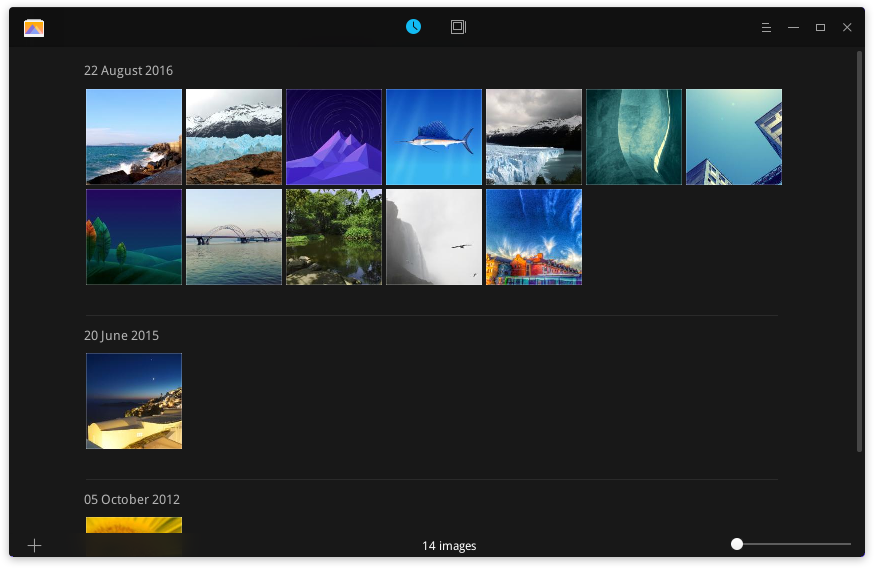

#### Image Zooming

The thumbnails of images in Timeline can be zoomed.
1. At the lower-right corner of Deepin Image Viewer interface, click on the slider in the sliding bar.
2. Drag the slider left/right to zoom out/zoom in.

#### Sync Image

Deepin Image Viewer will sync the managed folder when it startup.

1. In the timeline of the Deepin Image Viewer interface, Click on  icon at the lower left corner.
2. Click on ** Add folder ** and select the folder storing the image.
3. Click on ** Open** to sync the image to the timeline.

> ：User can click on the × at the sync folder line to cancel sync on the auto scan directory manage interface.

#### Add Image to My Favorites

User can add favorite images to My favorites.
1. In Timeline of Deepin Image Viewer interface, open an image.
2. Right click on the image and select ** Add to My favorites**, or click on  to add the image to My favorites.
3. Right click on the image and select ** Remove from album**, or click on  to remove the image from My favorites.

#### Add Image to an Album

User can add images to an album.
1. In Timeline of Deepin Image Viewer interface, open an image.
2. Right click on the image and select ** Add to Album**.
3. Choose an album to add the image to the album.

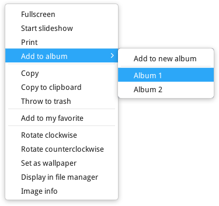

### Display in File Manager

User can locate the directory where the image is stored.
1. Right click on the image in Deepin Image Viewer interface and select ** Display in file manager**.
2. The folder where the image is stored will pop up.

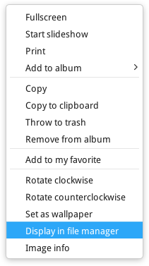

### Album

Click on  in Deepin Image Viewer interface to enter Album interface.
User can view all the albums in Album interface. It will display album thumbnails, names and the date range of the images in albums.

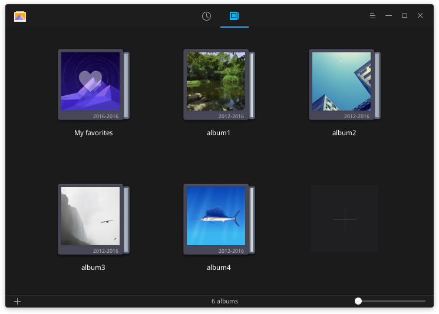

> : There is a default album in Deepin Image Viewer, called ** My favorites** where user's favorite images can be found. This album can not be deleted or renamed.

#### Album Zooming

The thumbnail images of albums can be zoomed.
1. At the lower-right corner of Deepin Image Viewer interface, click on the slider in the sliding bar.
2. Drag the slider left/right to zoom out/zoom in.

#### New Album

User can create new albums to categorize images.
1. In Album interface, click on  and select **New album **.
2. Input a name for the new album, then press  or click on blank area.

> : User can also click on **+ ** to create a new album.

#### Add Image to Album

User can add image to album by the following ways:
- By ** Sync Folder ** to add image to the album and the folder will also add to the timeline.
- By ** Add to Album ** at the timeline interface.
- Directly drag images from file manager and drop them on the album.

#### Remove Image from Album

In an album, right click on the image and select ** Remove from album** to remove the image from the album.

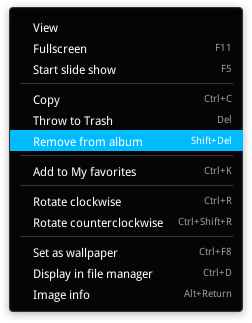

>: To delete an album, right click on the album icon and select ** Delete**, the images in the album will remain in Timeline and the disk.

#### Copy Album

In Album interface, right click on the album icon and select ** Copy** to copy all the images in the album.

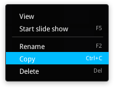

#### Rename Album

1. In Album interface, right click on the album and select ** Rename**.
2. Input a name and press  or click on blank area.

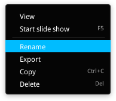

## Main Menu|../common/icon_optionsetting.svg|

In ** Main Menu **, user can create a new album, set the options, view information on Deepin Image Viewer and Exit the application.
In Deepin Image Viewer interface, click on  to enter ** Main Menu **.

### Switch Theme

In ** Main Menu **, select/unselect **Deep color mode** to switch theme.

### Settings

1. In ** Main Menu **, click on ** Settings **  to enter ** Settings **.
2. User can adjust the following settings by their need:
   - Set the effect and duration of the slideshow.
   - View the default shortcuts and custom them.
   - Restore to the default settings.

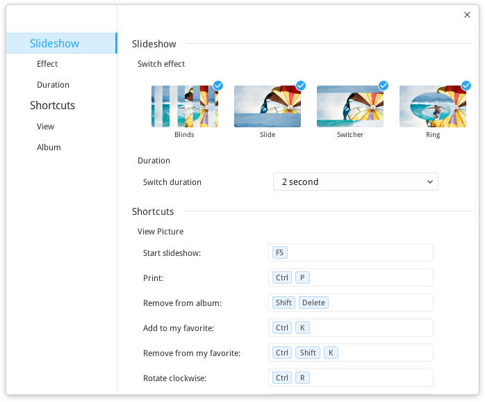

### Help

In ** Main Menu **, select ** Help ** to view the manual for Deepin Image Viewer.

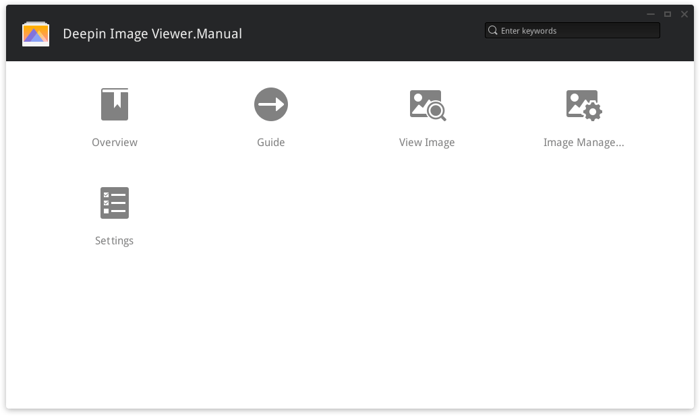

### About

In ** Main Menu **, select ** About** to check the version and introduction of Deepin Image Viewer.

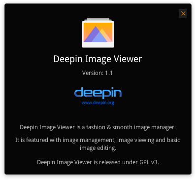

### Exit

In ** Main Menu **, select ** Exit** to exit Deepin Image Viewer.
